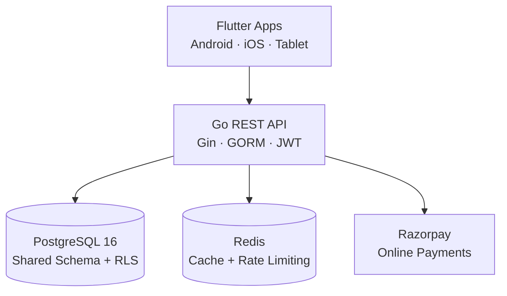
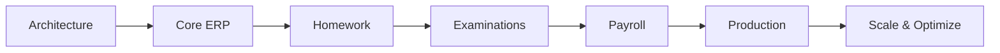

# Vidya — Multi-Tenant School ERP SaaS

**Vidya** is a production-oriented, multi-tenant **School ERP SaaS platform** built with **Flutter, Go, PostgreSQL, and Redis**.

It is designed as a mobile-first platform for managing schools, students, attendance, fees, announcements, notifications, dashboards, and role-based access — with an architecture designed to scale as additional modules are introduced.


> **Repository status:** Architecture documentation for all 8 phases + a compiling, runnable monorepo scaffold.

---

## ✨ What Is Included?

The repository currently contains:

* Authentication & authorization
* Multi-tenant school setup
* Student management
* Attendance
* Fee management
* Offline fee payments
* Razorpay orders & webhooks
* Announcements
* Notifications
* Dashboard
* RBAC
* Tenant isolation
* Light/dark theme system
* Docker-based infrastructure
* CI pipeline

The following modules are already **designed and schema'd**, but currently registered as `501 Not Implemented` stubs:

* Homework
* Examinations
* Payroll

---

## 🧱 Architecture



### Backend Architecture

Vidya uses a **modular monolith** rather than a microservices-first architecture.

Each domain is isolated behind clear module boundaries while sharing a single deployable backend.

```text
backend/
└── internal/
    ├── auth/
    ├── tenant/
    ├── students/
    ├── attendance/
    ├── fees/
    ├── announcements/
    ├── notifications/
    └── dashboard/
```

This keeps local development and deployment relatively simple while leaving room for future service extraction if individual modules eventually need independent scaling.

---

## 🔐 Multi-Tenancy

Tenant isolation is implemented using multiple layers of protection:

```text
JWT Claims
    │
    ▼
Tenant Context
    │
    ▼
Repository Scoping
    │
    ▼
PostgreSQL Row-Level Security
```

Every tenant-owned record is associated with a `school_id`.

Production deployments additionally use PostgreSQL **Row-Level Security (RLS)** as defense-in-depth against accidental cross-tenant access.

---

## 💳 Payments

The fee system uses an **append-only ledger** designed for traceability and idempotent payment processing.

Supported flows:

* Offline fee payments
* Razorpay order creation
* Razorpay payment verification
* Razorpay webhooks
* Idempotent webhook processing
* Explicit payment state transitions
* Integer-based INR amounts

---

## 🔑 Authentication & RBAC

Authentication and authorization currently support:

* JWT access tokens
* Rotating refresh tokens
* OTP authentication for parents
* Device tracking
* Role-based access control
* Tenant-aware authorization
* Data-driven permissions

Authentication flow:

```text
Client
  │
  ▼
Login / OTP
  │
  ▼
JWT Access Token
  │
  ├── Tenant Context
  ├── User Identity
  └── Role / Permissions
  │
  ▼
Protected API
```

---

## 🎨 Theme System

The Flutter application uses a token-driven design system instead of scattering hardcoded colors throughout the UI.

```text
Design Tokens
      │
      ▼
Semantic Roles
      │
      ▼
Flutter ThemeData
      │
      ▼
Application UI
```

The system supports:

* Light mode
* Dark mode
* Centralized design tokens
* Semantic colors
* Typography tokens
* Spacing tokens
* Derived `ThemeData`
* Theme unit tests

---

# 📁 Repository Structure

```text
.
├── docs/
│   ├── 00-assumptions-and-decisions.md
│   ├── 01-requirements.md
│   ├── 02-architecture.md
│   ├── 03-database.md
│   ├── 04-api.md
│   ├── 05-frontend.md
│   ├── 06-backend.md
│   ├── 07-deployment.md
│   └── 08-roadmap.md
│
├── backend/
│   ├── cmd/
│   │   └── server/
│   │       └── main.go
│   ├── internal/
│   │   ├── config/
│   │   ├── server/
│   │   ├── pkg/
│   │   ├── events/
│   │   ├── deps/
│   │   ├── db/
│   │   ├── seeds/
│   │   └── modules/
│   │       ├── auth/
│   │       ├── tenant/
│   │       ├── students/
│   │       ├── attendance/
│   │       ├── fees/
│   │       ├── announcements/
│   │       ├── notifications/
│   │       └── dashboard/
│   ├── migrations/
│   │   └── 001_init.sql
│   ├── .env.example
│   ├── Dockerfile
│   └── Makefile
│
├── mobile/
│   ├── lib/
│   │   ├── core/
│   │   │   └── theme/
│   │   └── features/
│   │       ├── auth/
│   │       └── dashboard/
│   └── test/
│       └── theme_test.dart
│
├── deploy/
│   ├── docker-compose.yml
│   └── prometheus/
│
├── .github/
│   └── workflows/
│       └── ci.yml
│
└── SETUP.md
```

---

# 🚀 How to Run Vidya

There are two ways to run this app:

* **Option A — Docker (recommended first run):** one command starts the database, cache, and API, seeds demo data, and is ready to serve the Flutter app.
* **Option B — Local development:** run PostgreSQL/Redis in Docker, the Go API with the Go toolchain, and the Flutter app separately. Best when you are editing code.

> Prefer a click-by-click walkthrough? See [`SETUP.md`](SETUP.md).

## Prerequisites

* [Docker](https://docs.docker.com/get-docker/) (with the Compose plugin)
* [Go 1.23+](https://go.dev/dl/) — only for Option B
* [Flutter](https://docs.flutter.dev/get-started/install) — to run the mobile/web app
* Git

```bash
git clone <your-repository-url>
cd Vidya
```

---

## Option A — Run everything with Docker

```bash
docker compose -f deploy/docker-compose.yml up --build
```

This starts PostgreSQL, Redis, and the API. On first boot the API runs dev migrations and seeds a demo school (2 students + demo accounts). Leave the terminal open.

```bash
# In a second terminal — confirm the API is healthy
curl -s http://localhost:8080/health/ready
# => {"db":"up","status":"ready"}
```

The API is now at `http://localhost:8080`. To stop it:

```bash
docker compose -f deploy/docker-compose.yml down     # keep data
docker compose -f deploy/docker-compose.yml down -v  # wipe data and start fresh
```

---

## Option B — Run locally

### 1. Start the infrastructure (PostgreSQL + Redis)

```bash
docker compose -f deploy/docker-compose.yml up -d postgres redis
```

### 2. Configure and start the API

```bash
cd backend
cp .env.example .env        # defaults work for local development
make run                    # or: APP_SEED_ON_START=true go run ./cmd/server
```

The API listens on `http://localhost:8080`. In local mode the schema is created by GORM `AutoMigrate`; production uses the versioned SQL migrations via `make migrate` (see `APP_MIGRATE_ON_START` in `.env.example`).

### 3. Run the Flutter app

The API base URL depends on where the app runs. Pass it with `--dart-define`:

| Target | `API_BASE_URL` |
| ------ | -------------- |
| Web / desktop | `http://localhost:8080/api/v1` |
| Android emulator | `http://10.0.2.2:8080/api/v1` |
| iOS simulator | `http://localhost:8080/api/v1` |
| Physical device | `http://<your-computer-LAN-IP>:8080/api/v1` |

```bash
cd mobile
flutter pub get

# Web example (open the printed URL in a browser):
flutter run -d web-server --web-port 8081 \
  --dart-define=API_BASE_URL=http://localhost:8080/api/v1
```

---

## Verify it works

```bash
# 1. Health check
curl -s http://localhost:8080/health/ready

# 2. Log in (same call the app makes)
curl -s -X POST http://localhost:8080/api/v1/auth/login \
  -H 'Content-Type: application/json' \
  -d '{
    "identifier": "principal@greenwood.edu",
    "password": "admin12345",
    "device": { "device_id": "dev-1" }
  }'
```

The response contains an `access_token` and the user's `roles`. Use the demo credentials below to sign in from the app.

---

## Run the checks

```bash
# Backend
cd backend
make vet           # go vet ./...
make test          # go test ./...
make build         # compile the server binary

# Mobile
cd mobile
flutter analyze
flutter test
```

---

## Troubleshooting

| Symptom | Fix |
| ------- | --- |
| `docker: unknown shorthand flag: 'f'` | The Compose plugin is missing — install `docker-compose-plugin`. |
| Port `5432` / `6379` / `8080` already in use | Another service is using it. Stop it, or run `docker compose -f deploy/docker-compose.yml down` first. |
| Login returns `INVALID_CREDENTIALS` | Demo data did not seed. Run `docker compose -f deploy/docker-compose.yml down -v` then `up --build` again with `APP_SEED_ON_START=true`. |
| App shows "Could not load dashboard" | The API URL is wrong for your target — check the `--dart-define=API_BASE_URL` table above. |
| `flutter: command not found` | Add Flutter's `bin` to your `PATH`, then open a new terminal. |
| Android device blocks plain HTTP | The API uses `http://` in local dev; use the emulator host `10.0.2.2` or run the web target. |

---

# 🧪 Demo Accounts

> These credentials are for the seeded development environment only.
> **Do not use them in production.**

### School Administrator

```text
Email:    principal@greenwood.edu
Password: admin12345
```

### Platform Administrator

```text
Email:    admin@vidya.app
Password: admin12345
```

---

# ⚙️ Technology Stack

| Layer            | Technology           |
| ---------------- | -------------------- |
| Mobile           | Flutter              |
| State Management | Riverpod             |
| Routing          | go_router            |
| Backend          | Go                   |
| HTTP Framework   | Gin                  |
| ORM              | GORM                 |
| Database         | PostgreSQL 16        |
| Cache            | Redis                |
| Authentication   | JWT + Refresh Tokens |
| Authorization    | RBAC                 |
| Payments         | Razorpay             |
| Infrastructure   | Docker               |
| Monitoring       | Prometheus           |
| CI/CD            | GitHub Actions       |

---

# 🧠 Key Architecture Decisions

| Area               | Decision                                     |
| ------------------ | -------------------------------------------- |
| **Frontend**       | Flutter for a single cross-platform codebase |
| **Backend**        | Go modular monolith using Gin + GORM         |
| **Architecture**   | Domain-oriented module boundaries            |
| **Database**       | PostgreSQL 16                                |
| **Multi-tenancy**  | Shared schema + `school_id` + PostgreSQL RLS |
| **Caching**        | Redis                                        |
| **Payments**       | Append-only ledger + Razorpay                |
| **Authentication** | JWT access tokens + rotating refresh tokens  |
| **Authorization**  | Data-driven RBAC                             |
| **Events**         | Internal event bus seam                      |
| **Theming**        | Token → semantic role → `ThemeData`          |
| **Deployment**     | Docker + CI/CD                               |
| **Observability**  | Prometheus                                   |

---

# 📚 Documentation

The architecture is documented across eight phases:

| Phase | Document                                                          | Description                            |
| ----- | ----------------------------------------------------------------- | -------------------------------------- |
| 0     | [`Assumptions & Decisions`](docs/00-assumptions-and-decisions.md) | Architecture decisions and assumptions |
| 1     | [`Requirements`](docs/01-requirements.md)                         | Functional/non-functional requirements |
| 2     | [`Architecture`](docs/02-architecture.md)                         | System architecture and data flows     |
| 3     | [`Database`](docs/03-database.md)                                 | Schema, ERD, indexes, multi-tenancy    |
| 4     | [`API`](docs/04-api.md)                                           | REST API, schemas, authentication      |
| 5     | [`Frontend`](docs/05-frontend.md)                                 | Flutter architecture and theme system  |
| 6     | [`Backend`](docs/06-backend.md)                                   | Go architecture, modules and DI        |
| 7     | [`Deployment`](docs/07-deployment.md)                             | Docker, CI/CD, monitoring and DR       |
| 8     | [`Roadmap`](docs/08-roadmap.md)                                   | Milestones, sprints and future work    |

---

# 📊 Current Status

### Documentation

* [x] Phase 0 — Assumptions & Decisions
* [x] Phase 1 — Requirements
* [x] Phase 2 — Architecture
* [x] Phase 3 — Database
* [x] Phase 4 — API
* [x] Phase 5 — Frontend
* [x] Phase 6 — Backend
* [x] Phase 7 — Deployment
* [x] Phase 8 — Roadmap

### Backend

* [x] Authentication
* [x] Tenant management
* [x] Students
* [x] Attendance
* [x] Fees
* [x] Razorpay integration
* [x] Announcements
* [x] Notifications
* [x] Dashboard
* [x] Database migrations
* [x] Seed data
* [x] Health checks
* [x] `go build ./...`
* [x] `go vet ./...`

### Flutter

* [x] Project structure
* [x] Theme system
* [x] Light/dark mode
* [x] Routing
* [x] Authentication UI
* [x] Dashboard
* [x] Riverpod integration
* [x] Theme tests
* [x] CI integration

### Upcoming Modules

* [ ] Homework
* [ ] Examinations
* [ ] Payroll
* [ ] Expanded parent portal
* [ ] Expanded teacher workflows
* [ ] Background job processing
* [ ] Production deployment
* [ ] Extended observability

---

# 🗺️ Roadmap



See [`docs/08-roadmap.md`](docs/08-roadmap.md) for the detailed roadmap and sprint plan.

---

# 🏗️ Development Philosophy

Vidya intentionally follows a **modular-monolith architecture** instead of starting with microservices.

The goal is to provide:

* Clear domain boundaries
* Strong tenant isolation
* Simple local development
* Straightforward deployment
* Testable modules
* Explicit dependency injection
* Event-driven extension points
* A potential path toward service extraction when justified

> **The architecture should solve today's problems without creating tomorrow's distributed-system problems prematurely.**

---

# 🔒 Production Considerations

The repository provides a production-oriented architecture, but the current scaffold should **not be treated as a fully production-hardened deployment out of the box**.

Before production use, review and configure:

* Secrets management
* JWT signing keys
* Database credentials
* Razorpay production credentials
* CORS policy
* Rate limiting
* TLS termination
* Database backups
* Disaster recovery
* Monitoring and alerting
* Log aggregation
* Audit logging
* Data retention
* Privacy/compliance requirements
* Production Docker configuration

---

# 🤝 Contributing

Contributions, issues, architecture discussions, and improvements are welcome.

Before opening a pull request:

```bash
go build ./...
go vet ./...           
```

For Flutter:

```bash
flutter analyze
flutter test
```

Please keep new functionality aligned with the existing module boundaries and architectural decisions documented in [`docs/`](docs/).

---

# 📄 License

Vidya is distributed under the **Vidya Proprietary License**. See
[`LICENSE`](LICENSE) for the full terms. Redistribution and external
contributions require the terms described there.
