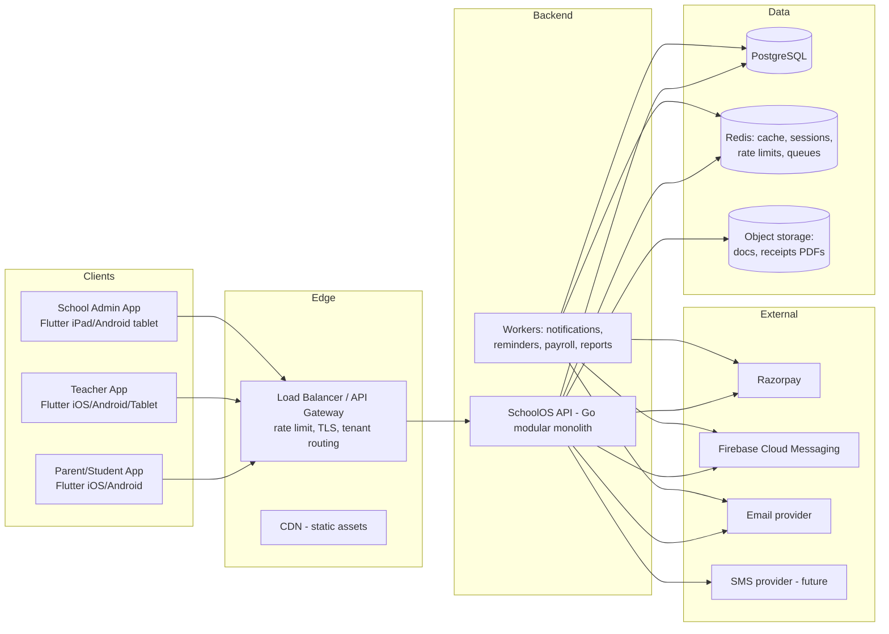
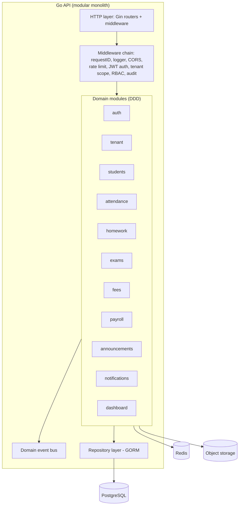
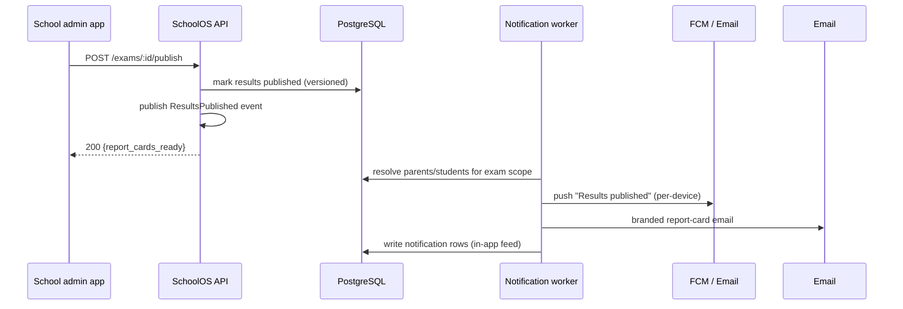
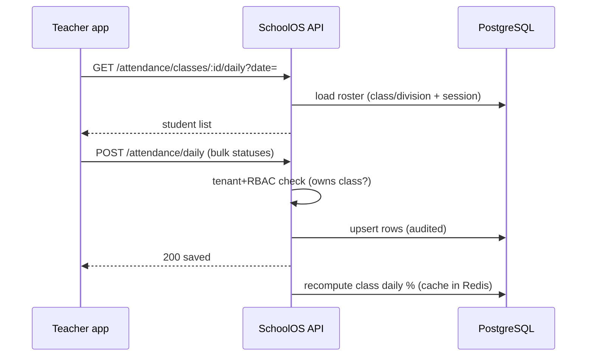

# Phase 2 — System Architecture

**Project:** SchoolOS — Multi-tenant School ERP SaaS

---

## 1. Architectural Style

**Modular Monolith (Go) with microservice-ready seams.**

| Decision | Choice | Rationale |
|---|---|---|
| Style | Modular monolith | One deployable, one DB transaction boundary — right for an ERP where fees↔payments↔results share invariants. Cheaper to operate than microservices at this scale. |
| Module boundaries | DDD: each module owns its domain + repository + service; modules communicate via internal interfaces (Go interfaces), never via shared mutable state. | Keeps the monolith from becoming a "big ball of mud"; lets modules split into services later. |
| Microservice-readiness | Events: modules publish domain events (e.g., `FeePaid`, `ResultPublished`) onto an internal bus that today writes notifications/audit, tomorrow becomes a Kafka/Redis Streams publisher. | The seams exist before they're needed. |
| API | REST (JSON) v1, `/api/v1` | Simple, versioned, mobile-friendly. GraphQL deferred. |
| Real-time | In-app notifications via polling + push (FCM). WebSocket/SSE deferred. | Matches v1 scale; avoids premature complexity. |
| Multi-tenancy | Shared schema, `school_id` column on all tenant tables + repository-level scoping + Postgres RLS (hardening) | Lowest cost per school at start; RLS gives defense-in-depth; per-tenant DB migration path documented for giants. |

---

## 2. System Context Diagram



---

## 3. Container / Component Diagram (Backend)



**Module responsibilities (bounded contexts)**

| Module | Owns | Publishes events | Consumes |
|---|---|---|---|
| tenant | schools, sessions, branding, plans | `SchoolProvisioned` | — |
| auth | users, roles, permissions, devices, sessions, OTP | `UserLoggedIn`, `UserRegistered` | — |
| students | students, guardians, documents, enrollments | `StudentEnrolled`, `StudentPromoted` | — |
| attendance | daily attendance records, analytics | `AttendanceMarked` | — |
| homework | homework, submissions, grades, resources | `HomeworkAssigned`, `SubmissionGraded` | — |
| exams | exams, schedules, grading systems, marks, results, report cards | `ResultsPublished` | — |
| fees | fee structures, ledgers, payments, receipts, dues | `FeePaid`, `FeeDueReminder` | — |
| payroll | teacher profiles, salary structures, runs, slips | `SalaryPaid` | — |
| announcements | announcements, targeting, read receipts, holidays | `AnnouncementPublished` | — |
| notifications | templates, deliveries, preferences, channels (in-app/FCM/email/SMS-iface) | — | all above |
| dashboard | read-model aggregation (cache-first) | — | all above |

---

## 4. Data Flow Diagrams

### 4.1 Online fee payment (core money path)

```mermaid
sequenceDiagram
    participant Parent as Flutter app (parent)
    participant API as SchoolOS API
    participant RZ as Razorpay
    participant DB as PostgreSQL
    participant RD as Redis
    participant NOT as Notification worker

    Parent->>API: POST /fees/orders (fee items, amount)
    API->>DB: validate outstanding, create fee_payment_orders (PENDING)
    API->>RZ: create Razorpay Order (amount, currency INR, receipt_id)
    API-->>Parent: 200 {order_id, razorpay_order_id, key_id}
    Parent->>RZ: checkout (UPI/card/netbanking)
    RZ-->>Parent: payment success callback
    RZ->>API: webhook payment.captured (signed)
    API->>API: verify signature + idempotency (order status)
    API->>DB: lock order; credit fee_ledger; create receipt (append-only)
    API->>RD: invalidate dashboard & dues cache
    API-->>RZ: 200 OK (fast ack)
    API->>NOT: publish FeePaid event
    NOT-->>Parent: push + email receipt + in-app notification
```

### 4.2 Result publication fan-out



### 4.3 Attendance marking (daily teacher flow)



---

## 5. Key Design Decisions

1. **Money paths are transactional & append-only.** Fee ledger never mutates; corrections post reversing entries. Payments idempotent via order status machine (`PENDING → PROCESSING → CAPTURED / FAILED / REFUNDED`).
2. **Read models & caching.** Dashboard/reports query precomputed aggregates cached in Redis (TTL 60 s), invalidated by domain events. Attendance % cached per class-day.
3. **Tenant context everywhere.** After JWT verification, a `TenantContext` (school_id + plan limits) is attached to the request; repositories are constructed with it, so a missing scope is a compile-time-ish guarantee via constructor injection, plus RLS in production.
4. **RBAC is data-driven.** Roles/permissions in DB; middleware resolves permission from JWT claims + DB role cache; `school_id` in every token claim.
5. **Outbox-ish reliability for notifications.** Domain events → Redis list/stream consumed by worker; retries with backoff; notification delivery is at-least-once, idempotent by `(event_id, user_id, channel)`.
6. **No cross-tenant queries.** Every query is anchored on `school_id`; platform super-admin queries use explicit cross-tenant read paths (reporting warehouse later).
7. **Graceful degradation.** If Redis is down, rate limiting falls back to in-memory, cache reads bypass to DB; if email/push is down, events stay queued (retry) and in-app rows are still written.

---

## 6. Scaling Path (documented, not built yet)

```
VPS + Docker Compose (MVP, 5-20 schools)
   │
   ▼
AWS ECS Fargate + RDS Postgres + ElastiCache Redis + S3 (50-200 schools)
   │
   ▼
Read replicas + sharding by school_id range (200+ schools)
   │
   ▼
Extract hot modules (fees, notifications) to services behind event bus
```

Phase 7 covers the first two tiers in detail.
