# Phase 3 — Database Design

**Engine:** PostgreSQL 16 · **Cache:** Redis 7 · **ORM:** GORM (scaffold) — canonical DDL in `backend/migrations/001_init.sql`

---

## 1. Multi-Tenancy Model

- **Shared schema, shared database.** Every tenant-scoped table carries `school_id UUID NOT NULL` as the **first column**, indexed.
- **Isolation layers (defense in depth):**
  1. JWT claims carry `school_id` → middleware builds a `TenantContext`.
  2. Repositories are constructed per-request with that context and always add `school_id = ?` (constructor injection makes it hard to forget).
  3. Production hardening: Postgres **Row-Level Security** policy `tenant_isolation` with `app.current_school_id` set per transaction (enabled in prod migration; toggleable in dev).
- **Session-scoped data:** students' class/division membership, fee structures, and attendance are anchored to `academic_sessions` — two sessions never mix.
- **Platform tables** (no `school_id`): `plans`, `schools`, `roles`, `permissions`, `role_permissions` (roles/permissions are shared catalogs; membership is per-school via `user_roles.school_id`).

---

## 2. ER Diagram

```mermaid
erDiagram
    SCHOOLS ||--o{ ACADEMIC_SESSIONS : has
    SCHOOLS ||--o{ USERS : has
    SCHOOLS ||--o{ CLASS_GROUPS : has
    SCHOOLS ||--o{ SUBJECTS : has
    SCHOOLS ||--o{ TEACHERS : has
    SCHOOLS ||--o{ ANNOUNCEMENTS : has
    SCHOOLS ||--o{ NOTIFICATIONS : has
    SCHOOLS ||--o{ FEE_HEADS : has
    SCHOOLS ||--o{ HOLIDAYS_EVENTS : has

    ACADEMIC_SESSIONS ||--o{ CLASS_DIVISIONS : defines
    CLASS_GROUPS ||--o{ CLASS_DIVISIONS : contains
    DIVISIONS ||--o{ CLASS_DIVISIONS : contains
    CLASS_DIVISIONS ||--o{ STUDENT_ENROLLMENTS : enrolls
    CLASS_DIVISIONS ||--o{ ATTENDANCE_RECORDS : tracks
    CLASS_DIVISIONS ||--o{ HOMEWORKS : targets
    CLASS_DIVISIONS ||--o{ CLASS_SUBJECTS : teaches
    SUBJECTS ||--o{ CLASS_SUBJECTS : assigned
    TEACHERS ||--o{ CLASS_SUBJECTS : teaches
    TEACHERS ||--o{ SALARY_STRUCTURES : has

    STUDENTS ||--o{ STUDENT_ENROLLMENTS : enrolled
    STUDENTS ||--o{ STUDENT_DOCUMENTS : has
    STUDENTS ||--o{ GUARDIANS : linked "via STUDENT_GUARDIANS"
    GUARDIANS ||--o{ STUDENT_GUARDIANS : linked
    STUDENTS ||--o{ EXAM_MARKS : scored
    STUDENTS ||--o{ FEE_LEDGER : owes

    USERS ||--o{ USER_ROLES : has
    ROLES ||--o{ USER_ROLES : grants
    ROLES ||--o{ ROLE_PERMISSIONS : contains
    PERMISSIONS ||--o{ ROLE_PERMISSIONS : granted

    USERS ||--o{ USER_DEVICES : logs_in
    USERS ||--o{ AUTH_SESSIONS : has
    USERS ||--o{ NOTIFICATION_PREFERENCES : configures
    USERS ||--o{ AUDIT_LOGS : acts
    USERS ||--o{ ANNOUNCEMENT_READS : reads

    FEE_HEADS ||--o{ FEE_STRUCTURES : configured
    FEE_STRUCTURES ||--o{ FEE_LEDGER : generates
    FEE_LEDGER ||--o{ PAYMENT_ALLOCATIONS : settled
    PAYMENTS ||--o{ PAYMENT_ALLOCATIONS : allocates
    PAYMENTS ||--o{ FEE_PAYMENT_ORDERS : originates
    PAYMENTS ||--o{ RECEIPTS : produces

    EXAMS ||--o{ EXAM_SCHEDULES : schedules
    EXAM_SCHEDULES ||--o{ EXAM_MARKS : records
    HOMEWORKS ||--o{ HOMEWORK_SUBMISSIONS : receives

    ANNOUNCEMENTS ||--o{ ANNOUNCEMENT_AUDIENCES : targets
    ANNOUNCEMENTS ||--o{ ANNOUNCEMENT_READS : tracks
    NOTIFICATIONS ||--o{ NOTIFICATION_DELIVERIES : sends
    NOTIFICATION_TEMPLATES ||--o{ NOTIFICATIONS : formats
```

---

## 3. Table Catalog

Naming: `snake_case`, plural. All IDs `UUID v4` (PK). Timestamps: `created_at`, `updated_at` (`timestamptz`). Tenant tables begin with `school_id`.

### Platform & Tenant
| Table | Key columns | Notes |
|---|---|---|
| `plans` | name, price_inr, max_students, max_teachers, feature_flags jsonb | subscription tiers |
| `schools` | name, code, board, address, phone, email, timezone, currency, branding jsonb (logo_url, primary_color, accent_color, letterhead), status, plan_id FK | brand = per-school config |
| `academic_sessions` | **school_id**, name ("2026-27"), starts_on, ends_on, is_active, promotion_cutoff | April–Mar default |
| `users` | **school_id**, full_name, email, phone, password_hash, avatar_url, status, last_login_at, is_superadmin | global auth principal |
| `roles` | code, name, description | shared catalog: school_admin, accountant, teacher, parent, student, platform_admin |
| `permissions` | code, name, module | e.g., `fees.payment.create` |
| `role_permissions` | role_id FK, permission_id FK | PK(role_id, permission_id) |
| `user_roles` | **school_id**, user_id, role_id, scope_class_id nullable | scope: teacher→classes |
| `user_devices` | **school_id**, user_id, device_id, device_name, platform, fcm_token, last_seen_at, revoked_at | push targets; revoke = logout device |
| `auth_sessions` | **school_id**, user_id, device_id, refresh_token_hash, ip, user_agent, expires_at, revoked_at | refresh-token rotation |
| `otp_codes` | **school_id**, phone/email, purpose, code_hash, expires_at, attempts, verified_at | TTL purged |

### Academics
| Table | Key columns | Notes |
|---|---|---|
| `class_groups` | **school_id**, name ("Class 6"), level int | stable across sessions |
| `divisions` | **school_id**, name ("A", "B") | sections |
| `class_divisions` | **school_id**, session_id FK, class_group_id FK, division_id FK, class_teacher_id FK nullable, strength | PK(school, session, class, division) |
| `subjects` | **school_id**, name, code, is_language | catalog |
| `class_subjects` | **school_id**, session_id, class_division_id FK, subject_id FK, teacher_id FK nullable, is_elective | teacher scope anchor |
| `teachers` | **school_id**, user_id FK, employee_code, designation, join_date, qualification, bank_details_encrypted, status | staff record |
| `students` | **school_id**, admission_no, first_name, last_name, dob, gender, blood_group, religion, address, photo_url, medical_notes, status | |
| `student_enrollments` | **school_id**, session_id, student_id, class_division_id, roll_no, admission_date, status (active/promoted/dropped) | session membership |
| `guardians` | **school_id**, user_id FK nullable, name, relation, phone, email, occupation, is_primary | |
| `student_guardians` | **school_id**, student_id, guardian_id, relation, priority | PK(student, guardian) |
| `student_documents` | **school_id**, student_id, doc_type, file_url, issued_on, expires_on, verified_by | S3 object |
| `attendance_records` | **school_id**, class_division_id, subject_id nullable, student_id, date, status (present/absent/late/half_day/leave), marked_by, edited_by nullable, edited_at nullable | one row/student/day; subject-optional for day attendance |

### Homework & Assignments
| Table | Key columns | Notes |
|---|---|---|
| `homeworks` | **school_id**, session_id, class_division_id, subject_id, teacher_id, title, description, due_at, max_marks, published_at | |
| `homework_attachments` | **school_id**, homework_id, file_url, file_name, size | |
| `homework_submissions` | **school_id**, homework_id, student_id, content, file_url, submitted_at, remarks, marks, graded_by, graded_at | |
| `assignments` | **school_id**, session_id, class_division_id, subject_id, teacher_id, title, description, due_at, rubric jsonb, resources jsonb, max_marks | long-form tasks |
| `assignment_submissions` | like homework_submissions + resubmission_count | |

### Exams & Results
| Table | Key columns | Notes |
|---|---|---|
| `exams` | **school_id**, session_id, name, exam_type (unit/term/final), class_division_id, starts_on, ends_on, status (draft/scheduled/ongoing/published) | |
| `exam_schedules` | **school_id**, exam_id, subject_id, date, start_time, end_time, max_marks, pass_marks | |
| `grading_systems` | **school_id**, name, is_default | e.g., CBSE |
| `grade_ranges` | **school_id**, grading_system_id, grade, grade_point, min_percent, max_percent, remark | |
| `exam_marks` | **school_id**, exam_schedule_id, student_id, marks_obtained, grade, is_absent, entered_by, status (draft/published) | versioned on publish |
| `result_publishes` | **school_id**, exam_id, published_at, published_by, report_card_url | publish history |
| `report_cards` | **school_id**, exam_id, student_id, pdf_url, generated_at | |

### Fees & Payments (append-only money paths)
| Table | Key columns | Notes |
|---|---|---|
| `fee_heads` | **school_id**, name, code, category (tuition/transport/hostel/lab/exam/misc), is_recurring, frequency (monthly/quarterly/term/yearly), tax_rate | |
| `fee_structures` | **school_id**, session_id, fee_head_id, class_division_id nullable, amount_inr, due_day int, applicable_from, applicable_to, is_active | amount per head per class |
| `fee_ledger` | **school_id**, session_id, student_id, fee_head_id, amount_inr, due_date, paid_amount_inr, concession_inr, status (due/partial/paid/waived), waived_by | one row per head per student; partial = paid < amount |
| `fee_installments` | **school_id**, fee_ledger_id, installment_no, amount_inr, due_date, paid_at | installment schedules |
| `fee_payment_orders` | **school_id**, student_id, amount_inr, currency, gateway, gateway_order_id, status (pending/processing/captured/failed/refunded), idempotency_key, created_by | Razorpay orders; webhook anchor |
| `payments` | **school_id**, student_id, order_id nullable, receipt_no, amount_inr, mode (cash/upi/card/netbanking/cheque/online), gateway_ref, paid_at, recorded_by, notes | append-only |
| `payment_allocations` | **school_id**, payment_id, fee_ledger_id, amount_inr | splits payment across heads |
| `receipts` | **school_id**, payment_id, receipt_no, pdf_url, issued_at | GST-compliant invoice fields |
| `refunds` | **school_id**, payment_id, amount_inr, reason, status, processed_by | reversing entries |

### Payroll
| Table | Key columns | Notes |
|---|---|---|
| `salary_structures` | **school_id**, teacher_id, effective_from, basic_inr, components jsonb, monthly_net | |
| `salary_runs` | **school_id**, month, year, status (draft/finalized/paid), total_amount, run_by | monthly batch |
| `salary_slips` | **school_id**, salary_run_id, teacher_id, gross_inr, deductions_inr, net_inr, component_breakdown jsonb, slip_url, paid_at, mode | history + PDF |

### Communication
| Table | Key columns | Notes |
|---|---|---|
| `announcements` | **school_id**, title, body, audience_scope (school/class/division/student/staff), publish_at, expires_at, status (draft/scheduled/published/archived), created_by | |
| `announcement_audiences` | **school_id**, announcement_id, class_division_id nullable, student_id nullable | resolution table |
| `announcement_reads` | **school_id**, announcement_id, user_id, read_at | read receipts |
| `holidays_events` | **school_id**, session_id, title, type (holiday/event/activity), starts_on, ends_on, audience_scope, description | school calendar |
| `notifications` | **school_id**, user_id, type, title, body, data jsonb, channel, read_at, created_at | in-app feed |
| `notification_deliveries` | **school_id**, notification_id, channel (inapp/push/email/sms), status (queued/sent/failed), attempts, last_error, delivered_at | idempotency key (event_id,user_id,channel) |
| `notification_templates` | **school_id** nullable, event_type, channel, subject, body_template | variable substitution |
| `notification_preferences` | **school_id**, user_id, event_type, channel, enabled | opt-in per category |

### Audit & Ops
| Table | Key columns | Notes |
|---|---|---|
| `audit_logs` | **school_id** nullable, user_id, action, entity_type, entity_id, changes jsonb, ip, user_agent, device_id, created_at | append-only; sensitive ops |
| `schema_migrations` | (golang-migrate) | |

---

## 4. Indexing Strategy

Composite indexes lead with `school_id` (tenant prefix) then the query's filter.

| Table | Index | Purpose |
|---|---|---|
| `student_enrollments` | `(school_id, session_id, class_division_id)` | roster by class/session |
| `student_enrollments` | `(school_id, student_id, session_id)` | student session lookup |
| `attendance_records` | `(school_id, class_division_id, date)` | daily bulk mark + daily % |
| `attendance_records` | `(school_id, student_id, date DESC)` | student trend |
| `attendance_records` | `(school_id, date)` | school-wide daily % |
| `fee_ledger` | `(school_id, student_id, status)` | dues by student |
| `fee_ledger` | `(school_id, status, due_date)` | defaulter list |
| `fee_ledger` | `(school_id, session_id, fee_head_id)` | head-wise reports |
| `payments` | `(school_id, paid_at DESC)` | payment history / reports |
| `fee_payment_orders` | `(school_id, gateway_order_id)` | webhook lookup; unique `(school_id, idempotency_key)` |
| `homeworks` | `(school_id, class_division_id, due_at)` | pending by class |
| `homework_submissions` | `(school_id, homework_id, student_id)` unique | one submission/student |
| `exam_marks` | `(school_id, exam_schedule_id, student_id)` unique | marks grid |
| `notifications` | `(school_id, user_id, created_at DESC)` | in-app feed |
| `notification_deliveries` | `(school_id, notification_id, channel)` unique | idempotency |
| `announcements` | `(school_id, status, publish_at)` | scheduled publish job |
| `users` | `(school_id, phone)` unique, `(school_id, email)` unique | login lookup |
| `auth_sessions` | `(school_id, user_id, revoked_at)` | active sessions |
| `audit_logs` | `(school_id, entity_type, entity_id, created_at DESC)` | audit trail queries |
| `holidays_events` | `(school_id, starts_on)` | calendar |

**Notes**
- Unique constraints guard duplicates: attendance `(school_id, class_division_id, student_id, date)`, enrollment `(school_id, session_id, student_id)`, roll `(school_id, session_id, class_division_id, roll_no)`.
- `created_at DESC` indexes on hot feeds use partial `WHERE` where sensible; v1 keeps full columns for simplicity.
- JSONB columns (branding, components, changes) are queried only inside their owning row — no GIN indexes needed in v1.
- Partitioning (by `school_id` hash) is the documented scale-out for `attendance_records`, `payments`, `audit_logs` when a tenant exceeds ~50M rows.

---

## 5. Data Integrity & Money Rules

- **Fee ledger is append-only.** No UPDATE of paid amounts; changes flow through `payments` + `payment_allocations` or `refunds` + reversing `fee_ledger` adjustments logged to `audit_logs`.
- **Payment idempotency:** `fee_payment_orders.idempotency_key` unique per school; Razorpay webhook processing is a state machine — a captured order can only credit the ledger once.
- **Attendance edits** create an audit entry (who edited, before/after) rather than silently overwriting history.
- **Result republish** writes a new `result_publishes` row (versioned), never mutating published marks in place.
- **Soft deletes** for students/teachers/guardians (kept for legal records); hard deletes only via platform admin with audit.

---

## 6. Encryption & Sensitive Data

- `password_hash`, `refresh_token_hash`, `otp` → bcrypt/SHA-256, never plaintext.
- `teachers.bank_details_encrypted`, guardian phone/email → **AES-256-GCM app-level encryption** (key from KMS/`APP_ENC_KEY` env, per-tenant key derivation documented in Phase 7).
- PII at rest protected by Postgres `pgcrypto` + app-level encryption; TLS in transit.
- Backups encrypted (pgBackRest/AWS RDS encryption), retained 30 days daily + 12 monthly.

Full DDL: see [`backend/migrations/001_init.sql`](../backend/migrations/001_init.sql) — the canonical, versioned schema.
